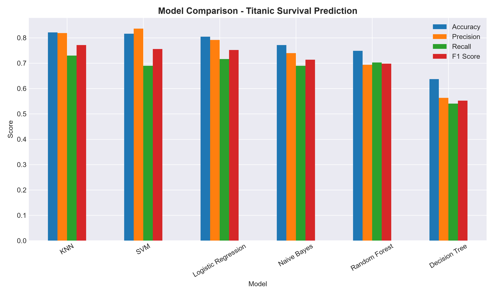
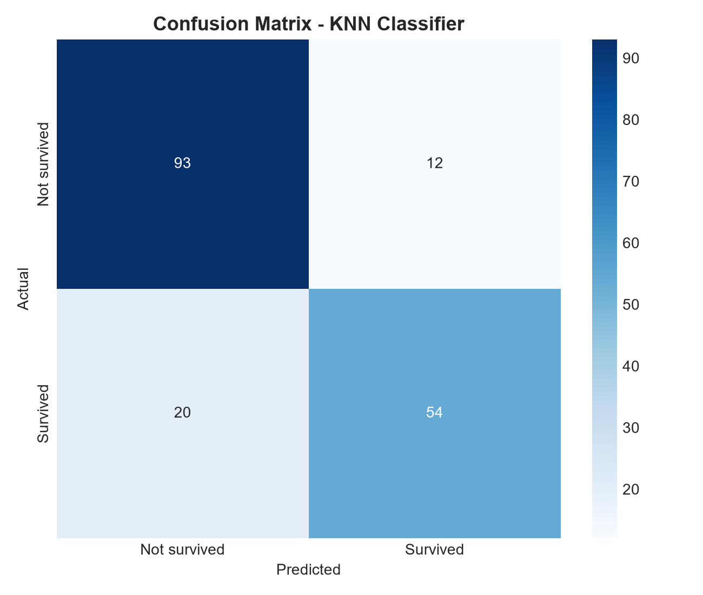

# Titanic Survival Prediction — Multi-Model Comparison

Comparing 6 classic Machine Learning algorithms on the Titanic dataset to predict passenger survival, using scikit-learn.

## 📌 Problem Statement
Predict whether a passenger survived the Titanic disaster based on features like age, gender, ticket class, and fare, using supervised classification algorithms.

## 📊 Dataset
- **Source:** [Kaggle - Titanic: Machine Learning from Disaster](https://www.kaggle.com/c/titanic/data)
- **Rows:** 891 passengers
- **Target:** `Survived` (0 = No, 1 = Yes)

## ⚙️ Approach
1. Data cleaning (handled missing values in Age, Embarked; dropped Cabin, Name, Ticket, PassengerId)
2. Encoding categorical features (Sex via Label Encoding, Embarked via One-Hot Encoding)
3. Feature scaling using StandardScaler
4. Trained and compared 6 classification algorithms:
   - Logistic Regression
   - Decision Tree
   - Random Forest
   - K-Nearest Neighbors (KNN)
   - Support Vector Machine (SVM)
   - Naive Bayes
5. Evaluated using Accuracy, Precision, Recall, and F1-Score

## 🏆 Results

| Model | Accuracy | Precision | Recall | F1-Score |
|-------|----------|-----------|--------|----------|
| KNN | 0.821 | 0.818 | 0.730 | 0.771 |
| SVM | 0.816 | 0.836 | 0.689 | 0.756 |
| Logistic Regression | 0.804 | 0.791 | 0.716 | 0.752 |
| Naive Bayes | 0.771 | 0.739 | 0.689 | 0.713 |
| Random Forest | 0.749 | 0.693 | 0.703 | 0.698 |
| Decision Tree | 0.637 | 0.563 | 0.541 | 0.552 |

**Best Model:** KNN (highest Accuracy and F1-Score)



## 🔍 Confusion Matrix (KNN)


## 🛠️ Tech Stack
Python, pandas, numpy, scikit-learn, matplotlib, seaborn

## 🚀 How to Run
```bash
pip install -r requirements.txt
jupyter notebook notebook.ipynb
```

## 📁 Project Structure
```
01-titanic-multi-model-comparison/
├── notebook.ipynb
├── README.md
├── model_knn.pkl
├── scaler.pkl
├── data/
└── images/
```