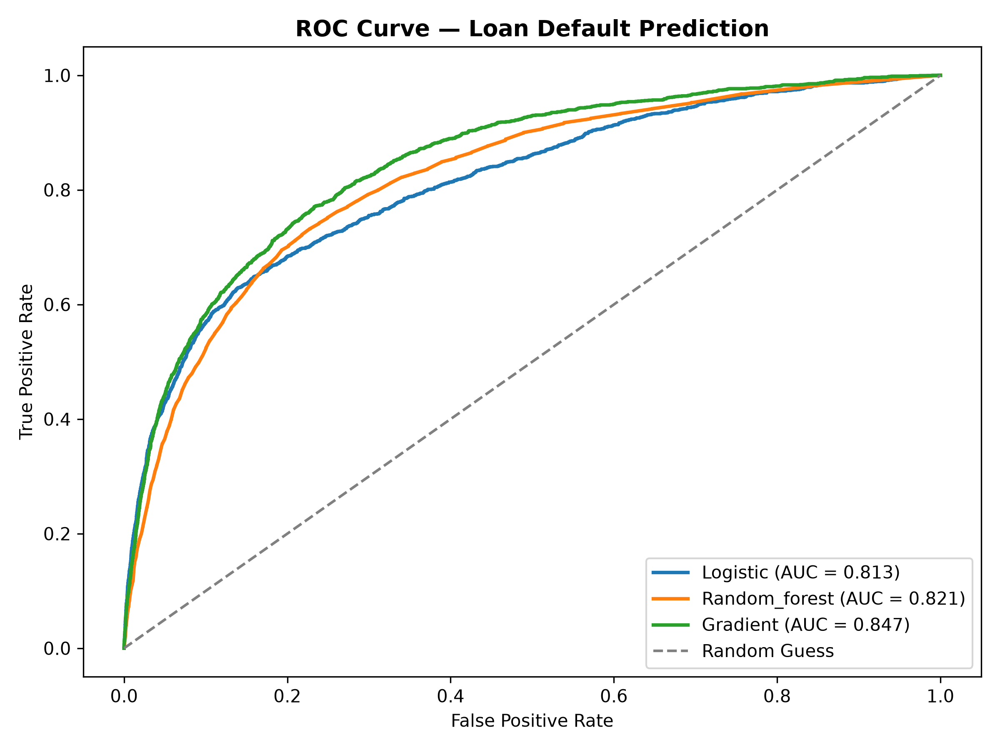
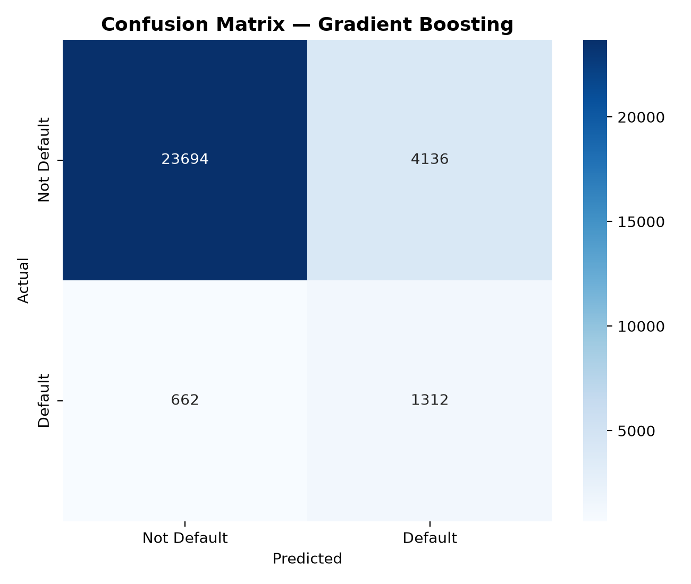

# Loan Default Prediction — Credit Risk Analysis

Predicting the probability that a borrower will experience serious financial distress (90+ days past due) within two years, using supervised classification on real-world, highly imbalanced financial data.

## 📌 Problem Statement
Banks need to assess credit risk before approving loans. This project builds a classification model to predict loan default (`SeriousDlqin2yrs`) based on a borrower's credit history, income, and debt profile — helping identify high-risk applicants.

## 📊 Dataset
- **Source:** [Kaggle - Give Me Some Credit](https://www.kaggle.com/c/GiveMeSomeCredit)
- **Rows:** ~150,000 borrowers (149,730 after cleaning)
- **Target:** `SeriousDlqin2yrs` (0 = Good borrower, 1 = Defaulter)
- **Class Imbalance:** ~93.3% Good vs ~6.7% Default — a realistic, challenging real-world distribution

## ⚙️ Approach
1. **Data Cleaning:** Handled missing values in `MonthlyIncome` and `NumberOfDependents` (median imputation); removed data entry errors (age = 0, placeholder value "98" in past-due columns)
2. **Train-Test Split:** Used `stratify=y` to preserve class distribution across train/test sets
3. **Feature Scaling:** StandardScaler applied to all features
4. **Class Imbalance Handling:** Applied **SMOTE** on training data only (to avoid data leakage into test evaluation) — balanced minority class from 6.7% to 50%
5. **Models Trained:** Logistic Regression, Random Forest, Gradient Boosting
6. **Evaluation Metrics:** Accuracy, Precision, Recall, F1-Score, and **ROC-AUC** (prioritized over accuracy due to class imbalance)

## 🏆 Results

| Model | Accuracy | Precision | Recall | F1-Score | ROC-AUC |
|-------|----------|-----------|--------|----------|---------|
| **Gradient Boosting** | 84.3% | 24.4% | **65.7%** | 0.356 | **0.847** |
| Random Forest | 89.5% | 30.1% | 44.8% | 0.360 | 0.821 |
| Logistic Regression | 85.0% | 24.7% | 61.9% | 0.353 | 0.813 |

**Best Model: Gradient Boosting** — selected based on ROC-AUC and Recall, not accuracy.

## 💡 Key Insight
In credit risk prediction, **Accuracy is misleading** due to severe class imbalance — a model predicting "no default" for everyone would still score 93% accuracy while being completely useless. A **False Negative** (missing an actual defaulter) is far costlier to a bank than a **False Positive** (flagging a good borrower for extra review). This is why **Recall and ROC-AUC** were prioritized over Accuracy when selecting the final model — Gradient Boosting caught 66% of actual defaulters compared to Random Forest's 45%, despite having lower raw accuracy.



## 🔍 Confusion Matrix (Gradient Boosting)


## 🛠️ Tech Stack
Python, pandas, numpy, scikit-learn, imbalanced-learn (SMOTE), matplotlib, seaborn

## 📁 Project Structure
```
02-loan-default-prediction/
├── notebook.ipynb
├── README.md
├── model_gradient_boosting.pkl
├── scaler.pkl
├── data/
└── images/
```