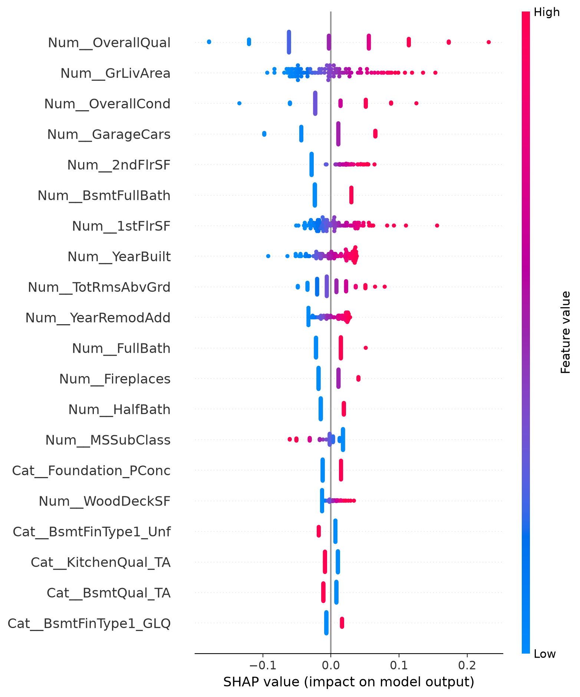
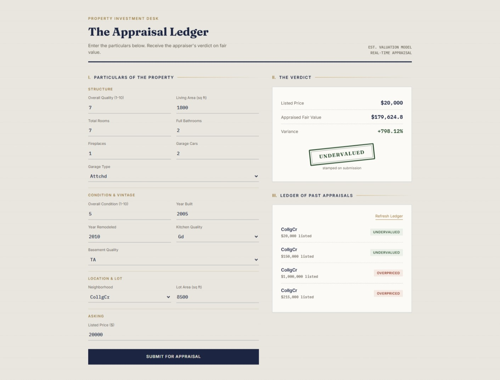

# Real Estate Investment Scoring System

A full-stack machine learning application that predicts a property's fair market value and generates an "Investment Score" — helping identify whether a listed property is undervalued, fairly priced, or overpriced.

## Problem Statement

Property investors need more than just a price prediction — they need to know whether the asking price represents good value. This project builds an end-to-end system: an ML model estimates fair value from property characteristics, and compares it against the listed price to generate an actionable investment verdict.

## Architecture
React Frontend (Vite + Tailwind)
│ POST /predict
▼
FastAPI Backend
│
├── Loads trained sklearn Pipeline (joblib)
├── Merges user input with dataset-derived defaults
├── Runs prediction + calculates Investment Score
└── Persists every request to SQL Server (SQLAlchemy ORM)


## Dataset

- **Source:** Kaggle - House Prices: Advanced Regression Techniques
- **Rows:** 1,460 properties, 79 features
- **Target:** `SalePrice` (log-transformed for training)

## Machine Learning Approach

1. Missing value handling — distinguished "feature doesn't exist" (e.g. no pool) vs. genuinely missing data
2. Built a `Pipeline` + `ColumnTransformer` to automatically preprocess 36 numeric and 43 categorical features
3. Compared Linear Regression, Ridge, Lasso, ElasticNet, Random Forest, and Gradient Boosting
4. Tuned Ridge regularization strength using `GridSearchCV` with 5-fold cross-validation
5. Used **SHAP** to explain which features drive price predictions
6. Selected the top 14 most influential features to expose through the API/UI, with the remaining features filled from dataset medians/modes

## Results

| Model | MAE | RMSE | R² |
|-------|-----|------|-----|
| **Linear Regression** | 0.090 | 0.131 | **0.907** |
| Ridge | 0.092 | 0.132 | 0.907 |
| ElasticNet | 0.092 | 0.133 | 0.905 |
| Gradient Boosting | 0.092 | 0.135 | 0.903 |
| Lasso | 0.095 | 0.138 | 0.898 |
| Random Forest | 0.099 | 0.146 | 0.885 |



## Backend (FastAPI + SQL Server)

- `POST /predict` — accepts 14 property features + listed price, returns predicted fair value, investment score, and verdict
- `GET /history` — returns the 50 most recent appraisals
- Every prediction is persisted to a SQL Server database via SQLAlchemy ORM
- Input validation enforced through Pydantic models and Enums (fixed dropdown-style categorical values)

## Frontend (React + Tailwind)

A custom "Appraisal Ledger" themed interface — styled like a property appraisal document, with a stamp-style animated verdict (Undervalued / Overpriced / Fair Value) and a running ledger of past appraisals.



## Tech Stack

**ML:** Python, pandas, scikit-learn, SHAP, joblib
**Backend:** FastAPI, SQLAlchemy, Pydantic, SQL Server
**Frontend:** React, Vite, Tailwind CSS

## Project Structure

03-real-estate-investment-scoring/
├── notebook.ipynb # Model training & experimentation
├── app/
│ ├── main.py # FastAPI app + endpoints
│ ├── database.py # SQL Server connection
│ ├── models.py # SQLAlchemy table schema
│ └── schemas.py # Pydantic request/response models
├── frontend/ # React + Tailwind app
├── model/
│ ├── best_pipeline.pkl # Trained sklearn Pipeline
│ └── feature_defaults.pkl # Median/mode defaults for unused features
├── create_tables.py # One-time DB table creation script
├── data/
└── images/


## How to Run

**Backend:**
```bash
pip install fastapi uvicorn sqlalchemy pyodbc joblib pandas numpy scikit-learn
python create_tables.py
python -m uvicorn app.main:app --reload
```

**Frontend:**
```bash
cd frontend
npm install
npm run dev
```