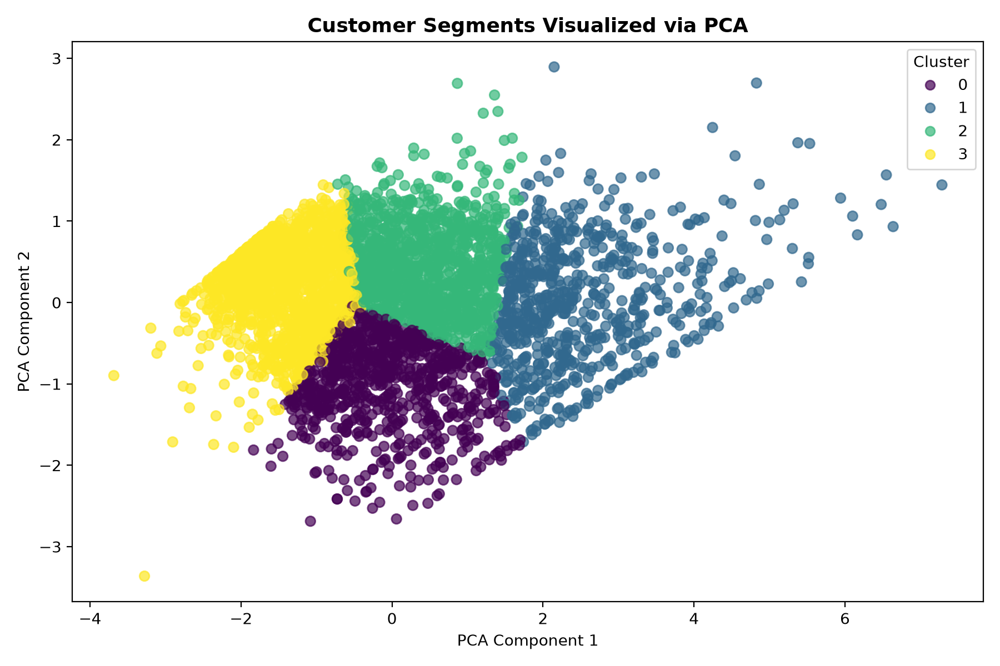

# Customer Segmentation — RFM Analysis & Clustering

Segmenting e-commerce customers into actionable groups using RFM (Recency, Frequency, Monetary) analysis and K-Means clustering, to help a business prioritize marketing efforts and retention strategy.

## 📌 Problem Statement
Not all customers are equal — some are highly engaged repeat buyers, others have gone dormant. This project segments customers into distinct behavioral groups using unsupervised learning, without any predefined labels, to answer: *"Who are our most valuable customers, and who is at risk of churning?"*

## 📊 Dataset
- **Source:** [UCI/Kaggle - Online Retail Dataset](https://archive.ics.uci.edu/dataset/352/online+retail)
- **Rows:** 541,910 transactions → 397,925 after cleaning
- **Period:** Dec 2010 – Dec 2011, UK-based online retailer
- **Customers analyzed:** 4,339 unique customers

## ⚙️ Approach
1. **Data Cleaning:** Removed transactions with missing Customer ID (~25% of data) and cancelled orders (Invoice numbers starting with 'C')
2. **Feature Engineering (RFM):**
   - **Recency:** Days since each customer's last purchase
   - **Frequency:** Number of unique orders placed
   - **Monetary:** Total amount spent
3. **Transformation:** Applied log transformation (`log1p`) to handle extreme outliers (e.g., wholesale buyers), then standardized features using StandardScaler
4. **Cluster Selection:** Used the Elbow Method and Silhouette Score across K=2 to K=10 to determine the optimal number of clusters
5. **Clustering:** Applied K-Means (K=4) to segment customers
6. **Visualization:** Used PCA to reduce RFM features to 2D for cluster visualization

## 🏆 Results — Customer Segments

| Segment | Avg Recency | Avg Frequency | Avg Monetary | Count | % of Customers |
|---------|-------------|----------------|---------------|-------|-----------------|
| **Champions** | 12.1 days | 13.6 orders | £8,015 | 723 | 16.7% |
| **New/Promising** | 18.7 days | 2.1 orders | £538 | 839 | 19.3% |
| **At Risk** | 70.7 days | 4.1 orders | £1,791 | 1,183 | 27.3% |
| **Lost/Dormant** | 184.0 days | 1.3 orders | £342 | 1,594 | 36.7% |



## 💡 Key Insight
Only **16.7% of customers (Champions)** drive the majority of engagement and spend, while **36.7% have gone dormant** — a classic Pareto (80/20) pattern seen in retail businesses. This segmentation enables targeted action: loyalty rewards for Champions, win-back email campaigns for At-Risk and Lost customers, and onboarding nurture flows for New customers — rather than a one-size-fits-all marketing approach.

## 🛠️ Tech Stack
Python, pandas, numpy, scikit-learn (KMeans, PCA, StandardScaler), matplotlib, seaborn

## 📁 Project Structure
```
01-customer-segmentation-rfm/
├── notebook.ipynb
├── README.md
├── kmeans_model.pkl
├── scaler.pkl
├── rfm_segments.csv
├── data/
└── images/
```